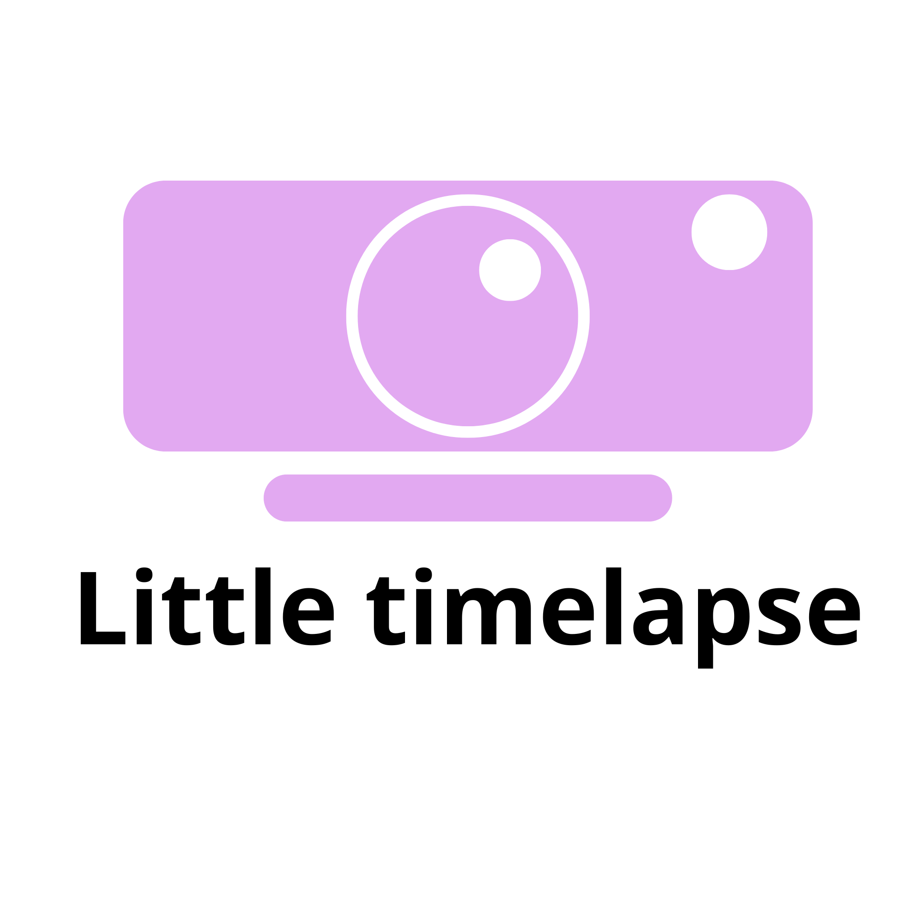

# 📸 Timelapse Tool

Un utilitaire léger qui transforme votre webcam en caméra de timelapse. Il gère automatiquement le téléchargement de FFmpeg et permet de compiler les photos en vidéo MP4.



# 🚀 Guide de démarrage rapide (Windows)

Pas besoin d'installer Go ou FFmpeg manuellement, suivez simplement ces étapes :

## 1. Téléchargement

1. Allez dans l'onglet **[Releases](https://github.com/kazeyoba/little-timelapse/releases)** de ce projet.
2. Téléchargez le fichier `timelapse-tool.exe`.

## 2. Lancement

1. Placez le `.exe` dans un dossier dédié (ex: `C:\Scripts\Timelapse`).
2. Ouvrez un **Terminal** (Faites `Shift + Clic droit` dans le dossier -> "Ouvrir dans le terminal" ou "Ouvrir une fenêtre PowerShell").
3. Lancez la capture avec la commande suivante :

   ```powershell
   ./timelapse-tool.exe --projet mon_timelapse --interval 10
   ```

## 3. Utilisation

* **Choix de la caméra** : Le script listera vos caméras. Tapez le chiffre correspondant (ex: `0`) et validez avec `Entrée`.
* **Capture** : Le script prendra une photo toutes les X secondes.
* **Arrêter** : Faites `Ctrl + C` dans le terminal pour stopper.

# 🛠️ Options de ligne de commande

| Flag | Description | Défaut |
| :--- | :--- | :--- |
| `--projet` | Nom du dossier où stocker les images | **Requis** |
| `--interval`| Temps entre chaque photo (secondes) | `5` |
| `--render`  | Compile les images existantes en vidéo MP4 | `false` |

## Exemples :

**Prendre une photo toutes les minutes :**

```bash
./timelapse-tool.exe --projet jardin --interval 60
```

**Générer la vidéo finale :**

```bash
./timelapse-tool.exe --projet jardin --render
```

# ⚙️ Comment ça marche ?

1. **Auto-Setup** : Au premier lancement, le programme télécharge une version portable de FFmpeg dans le dossier `ffmpeg_bin`.
2. **Capture** : Utilise l'API `dshow` (DirectShow) de Windows pour capturer des images en haute résolution (1920x1080).
3. **Reprise** : Si vous relancez le script sur un projet existant, il détecte automatiquement le dernier numéro d'image pour ne pas écraser vos fichiers.
